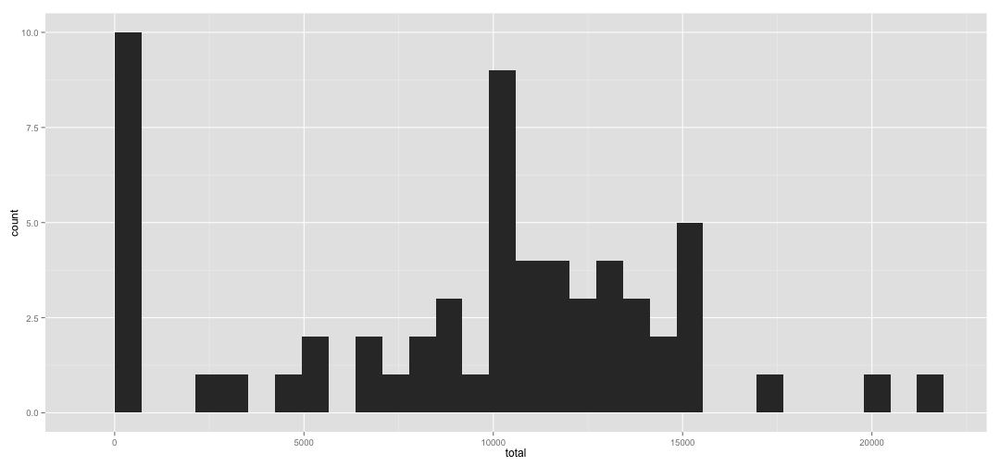
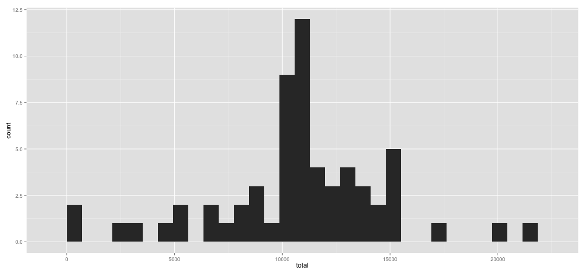

##Setup
First, setup your work directory path. For example, here is my path below. If you are using R Studio, you can also set it from Session > Set Working Directory > To Source File Location.


```r
setwd("~/work/r/class/RepData_PeerAssessment1")
```

Below is the list of required R packages for this analysis:
* data.table
* ggplot2
* gridExtra

Download and extract Zip file if it was not extracted yet

```r
if (!file.exists("activity.zip")){
  download.file("https://d396qusza40orc.cloudfront.net/repdata%2Fdata%2Factivity.zip","activity.zip",method="curl")
}

if (!file.exists("activity.csv")){
  unzip("activity.zip")
}
```

##Loading Data
Next, load the data file

```r
library(data.table)
data<-fread("activity.csv")
```

##Calculate Steps per Day and Histogram

```r
library(ggplot2)
sum_by_date <- data[,list(total=sum(steps,na.rm=T)),by=date]
```

Draw histogram of Steps per Day

```r
ggplot(sum_by_date, aes(x=total)) + geom_histogram()
```

```
## stat_bin: binwidth defaulted to range/30. Use 'binwidth = x' to adjust this.
```

 

##Mean and Median

```r
mean_val1<-mean(sum_by_date$total)
mean_val1
```

```
## [1] 9354
```

```r
median_val1<-median(sum_by_date$total)
median_val1
```

```
## [1] 10395
```

##The average daily activity pattern
Time Series Plot would be generated as below. The 5-minute interval and the average number of steps taken, averaged across all days.


```r
avg_interval <- data[,list(avg=mean(steps,na.rm=T)),by=interval]
head(avg_interval,5)
```

```
##    interval     avg
## 1:        0 1.71698
## 2:        5 0.33962
## 3:       10 0.13208
## 4:       15 0.15094
## 5:       20 0.07547
```

```r
ggplot(data=avg_interval,aes(x=interval,y=avg)) + geom_line()
```

 

The max average steps and which interval is it?

```r
avg_interval[avg==max(avg_interval$avg),]
```

```
##    interval   avg
## 1:      835 206.2
```


Total Number of NA (Missing Values)

```r
sum(is.na(data$steps))
```

```
## [1] 2304
```

##Imputing missing values
Here is the approach that I took to fill those missing values. I've used average value of each interval in order to replace NA in steps column. Before filling data, I merged original data table with average table by interval as the key. Make sure order by date and interval after the process.

```r
data_avg<-merge(data,avg_interval,by="interval")[order(date,interval)]
head(data_avg,5)
```

```
##    interval steps       date     avg
## 1:        0    NA 2012-10-01 1.71698
## 2:        5    NA 2012-10-01 0.33962
## 3:       10    NA 2012-10-01 0.13208
## 4:       15    NA 2012-10-01 0.15094
## 5:       20    NA 2012-10-01 0.07547
```
After mergining tables, fill steps where it contains NA. I'm casting average steps as integer below. The second line is verification code. The number of NA should be zero.

```r
data_f<-data # copy data first
data_f[is.na(data_f$steps),c('steps')]<-as.integer(data_avg[is.na(data_f$steps),avg])
head(data_f,5)
```

```
##    steps       date interval
## 1:     1 2012-10-01        0
## 2:     0 2012-10-01        5
## 3:     0 2012-10-01       10
## 4:     0 2012-10-01       15
## 5:     0 2012-10-01       20
```

```r
sum(is.na(data$steps))
```

```
## [1] 2304
```

Here is the same analysis that I did above but I use the new data without missing values: histogram, mean and median.

```r
sum_by_date_f <- data_f[,list(total=sum(steps,na.rm=T)),by=date]
ggplot(sum_by_date_f, aes(x=total)) + geom_histogram()
```

```
## stat_bin: binwidth defaulted to range/30. Use 'binwidth = x' to adjust this.
```

 

```r
mean_val2<-mean(sum_by_date_f$total)
mean_val2
```

```
## [1] 10750
```

```r
median_val2<-median(sum_by_date_f$total)
median_val2
```

```
## [1] 10641
```

The histogram has been filled and bars are more smooth than first data set. The mean value slightly increased from 9354.23 to 10749.77. The median has been changed from 10395.00 to `r 10641.00. 


#Weekdays and Weekends
In this section, I will categorize date into two factors : weekday and weekend, and we explore the diffences.


```r
days<-weekdays(as.Date(data_f$date,'%Y-%m-%d'))
data_f[,c('day_in_week')]<-days
data_f[,c('day_type')]<-factor(days=='Saturday' | days=='Sunday', labels=c('weekday','weekend'))
head(data_f,5)
```

```
##    steps       date interval day_in_week day_type
## 1:     1 2012-10-01        0      Monday  weekday
## 2:     0 2012-10-01        5      Monday  weekday
## 3:     0 2012-10-01       10      Monday  weekday
## 4:     0 2012-10-01       15      Monday  weekday
## 5:     0 2012-10-01       20      Monday  weekday
```

Render weekend and weekday steps

```r
avg_weekend <- data_f[day_type == 'weekend',list(avg=mean(steps,na.rm=T)),by=interval]
g1<-ggplot(data=avg_weekend,aes(x=interval,y=avg)) + geom_line() + ggtitle("Average steps in Weekends")

avg_weekday <- data_f[day_type == 'weekday',list(avg=mean(steps,na.rm=T)),by=interval]
g2<-ggplot(data=avg_weekday,aes(x=interval,y=avg)) + geom_line() + ggtitle("Average steps in Weekdays")
library(gridExtra)
grid.arrange( g1, g2, nrow=2)
```

 

Patterns until 900 from the begining looks similar but after 1000, weekdays data shows less steps during daytime. This could be because of less activity during work hours.


Note:Generate .md document using knitr library

```r
#library(knitr)
#knit2html("PA1_template.Rmd")
```
